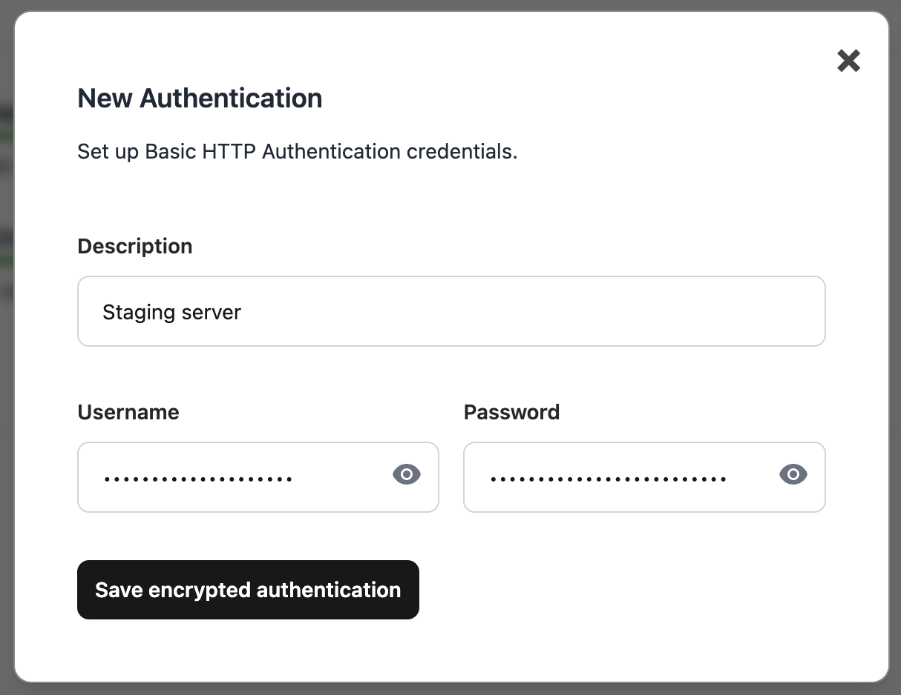
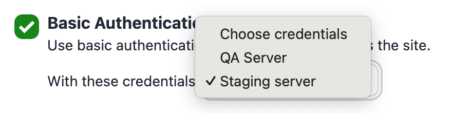

# Basic Authentication

Rocket Validator supports validating web pages that require [Basic HTTP Authentication](https://en.wikipedia.org/wiki/Basic_access_authentication), such as staging or development environments.

This advanced feature is available to all **[agency](https://rocketvalidator.com/pricing/)** and **[enterprise](https://rocketvalidator.com/contact?enterprise=true)** users.

## Setting up your credentials

In order to use Basic HTTP Authentication, you'll need to set up your credentials in the [Authentications section](https://rocketvalidator.com/basic_auths). You can add as many credentials as you need for the different servers you manage.

Credentials are stored in an encrypted format in the database. You can change or delete credentials at any time.

## Using your credentials in a validation report

Once you've set up your credentials, you can use them when running a validation report, or when setting up a [scheduled report](/scheduling/).

Rocket Validator will send the credentials you've set up as an authentication header when requesting pages to your server, as specified in the [Basic HTTP Authentication standard](https://developer.mozilla.org/en-US/docs/Web/HTTP/Headers/Authorization#basic_authentication_2).

## Safety considerations

At RocketValidator.com, we prioritize the protection of your information and credentials. We use industry-standard encryption protocols to secure all credentials. Read the updated [terms of service](https://rocketvalidator.com/terms#appendix-d) for more information on how we safely handle your credentials.

However, **you should never use Basic Authentication to protect sensitive data or production environments**. Usage of this feature is suited for development or staging environments only, and always in conjunction with **[HTTPS](https://en.wikipedia.org/wiki/HTTPS)**.

