# Changelog

Rocket Validator is continually evolving, this document describes the latest changes on the user interface and features.

## 2021, February 1st

The reports interface has had a major redesign, offering a lighter and faster UI, powered by Tailwind and Phoenix Live View.

All listings (web pages, html and accessibility issues) are now sortable by the different columns, and all can be filtered (per URL or issue message).

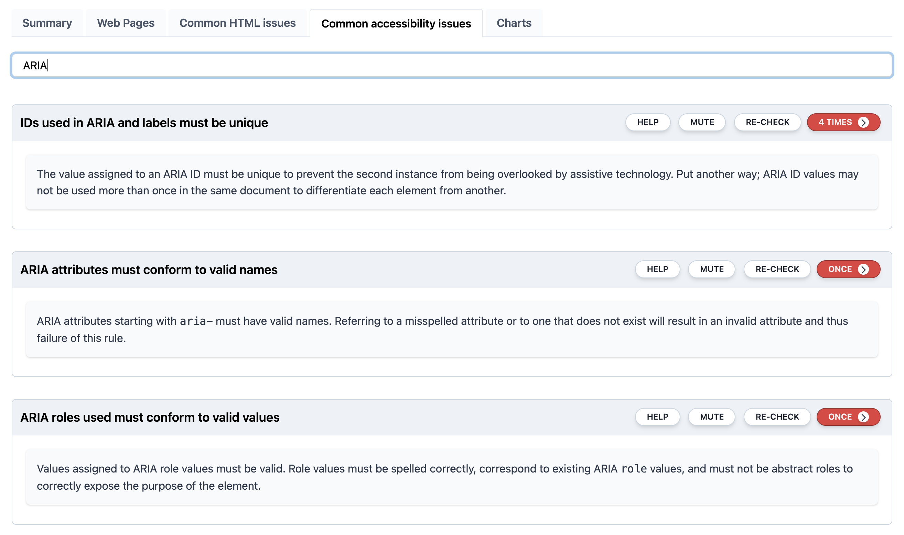

## 2020, July 6th

Summary reports has been upgraded to include the 3 main HTML and accessibility issues found.

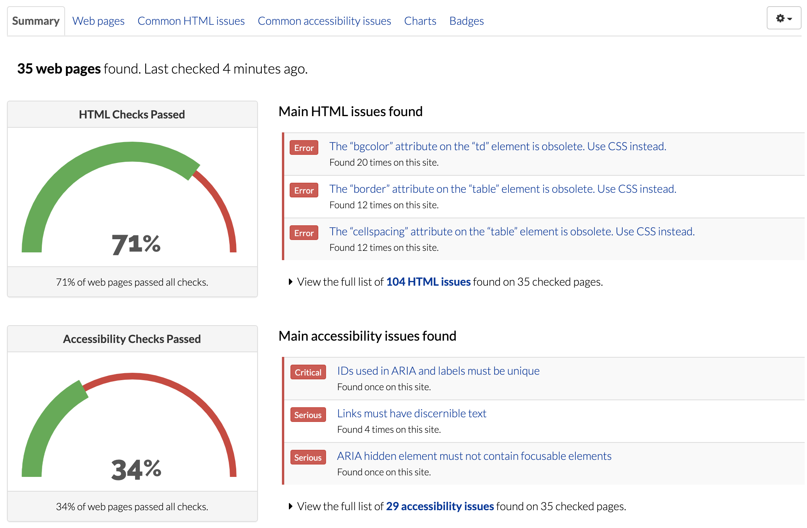

## 2020, June 21st

The user interface for reports has been redesigned to make it simpler, more accessible and easier to understand.

### User menu is now a drop-down list

The user menu at the top has been converted to a **drop-down menu**, instead of individual buttons.

=== "Current"
      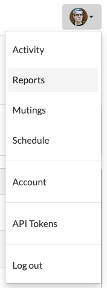 
=== "Previous"
    

### Reports list with column sorting and bulk deletion

The reports list has been simplified, by offering the right amount of information that is needed at this level. Instead of detailing the number of errors and warnings, we just show the **total number of issues** for each check.

**Columns are sortable** now, so with a click you can sort your reports by URL, number of web pages, number of HTML or accessibility issues, and creation date.

Reports can now be **bulk-deleted**. Instead of deleting reports one by one, you can check many and then click on the "Delete" button to remove them at once. Range selection is supported using the "shift" key.

=== "Current"
    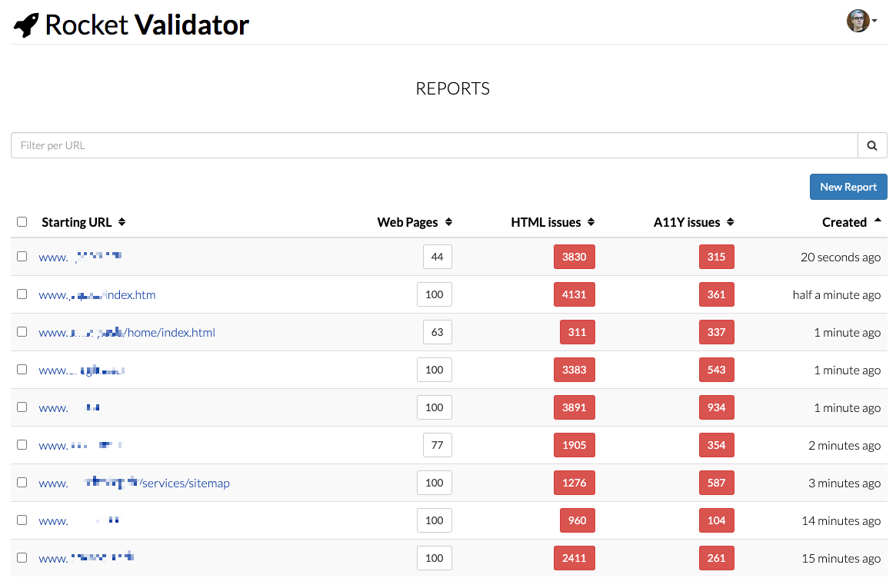

=== "Bulk deletion"
    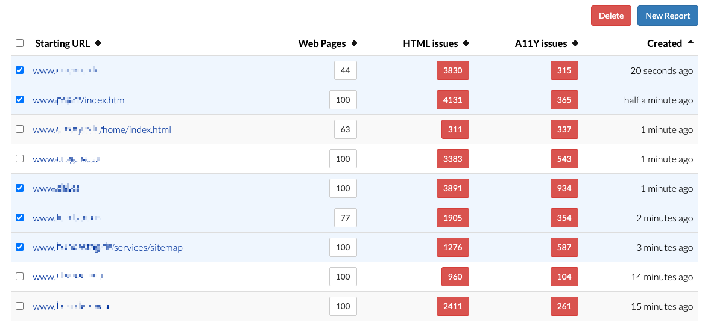

=== "Previous"
    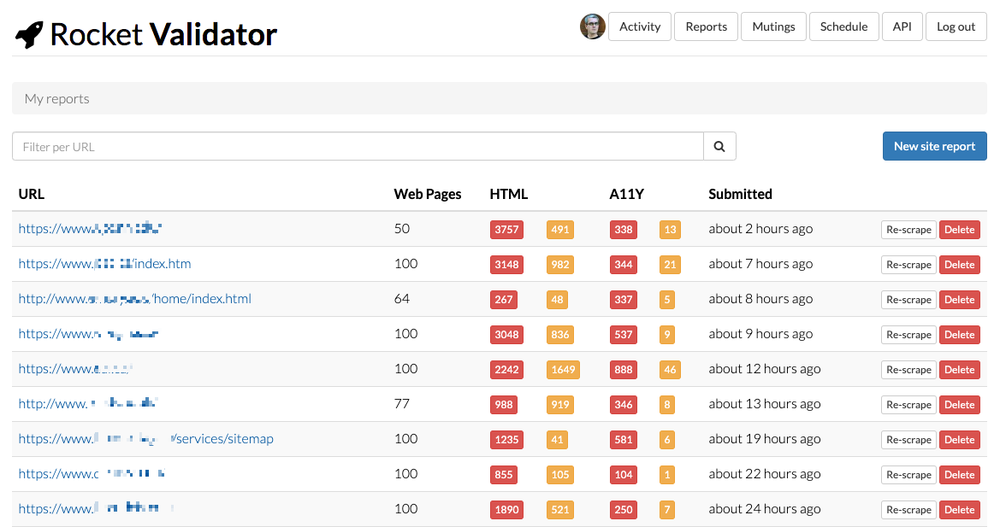

### Report summary includes more details and stats

The **new reports summary** view provides a high-level overview that lets you quickly understand the status of your checked site. While the previous summary report was just a horizontal colored bar, the new report summary includes:

* **Number of web pages** found.
* Total number of **HTML issues** found.
* Total number of **accessibility** issues found.
* **Mutings** applied, if any.
* **Time** of the last check.

Also, for the HTML and accessibility checks, a **progress gauge** shows the percentage of pages that passed all the checks.

=== "Current"
    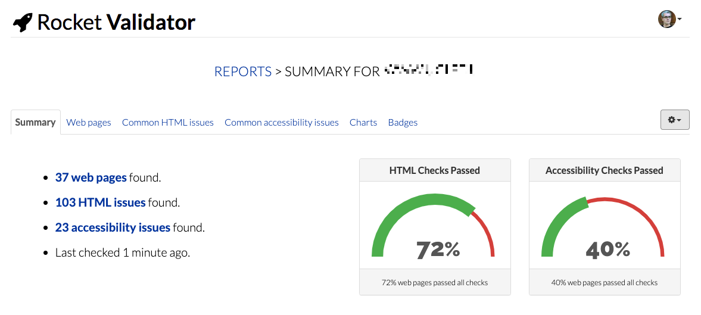

=== "Details"
    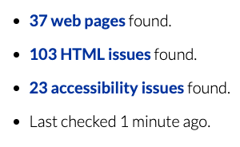

=== "Gauges"
    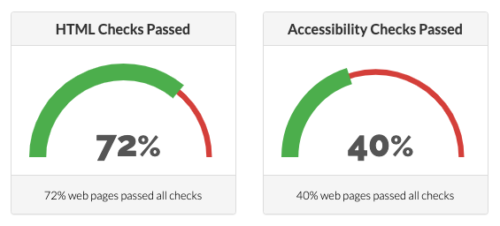

=== "Previous"
    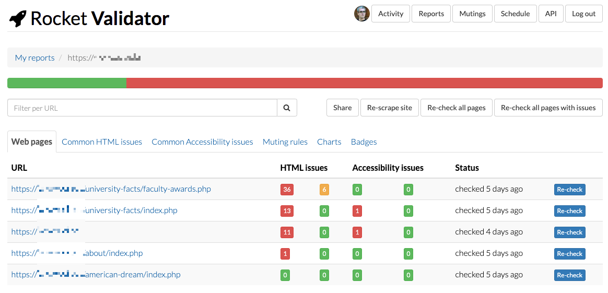

### Report actions are now a drop-down list

The report actions for re-scraping, re-checking and sharing reports are now bundled together in a **drop-down list**.

=== "Current"
    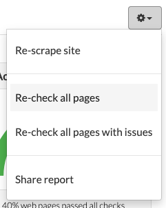

=== "Previous"
    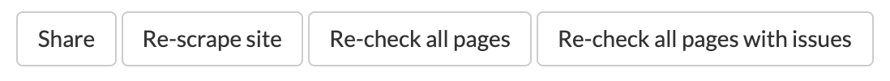

### Report web page list with column sorting and bulk recheck

The new report **web pages list can now be sorted** by URL, HTML or accessibility issues, or status.

Also, the web pages can be marked for **bulk re-checking**.

=== "Current"
    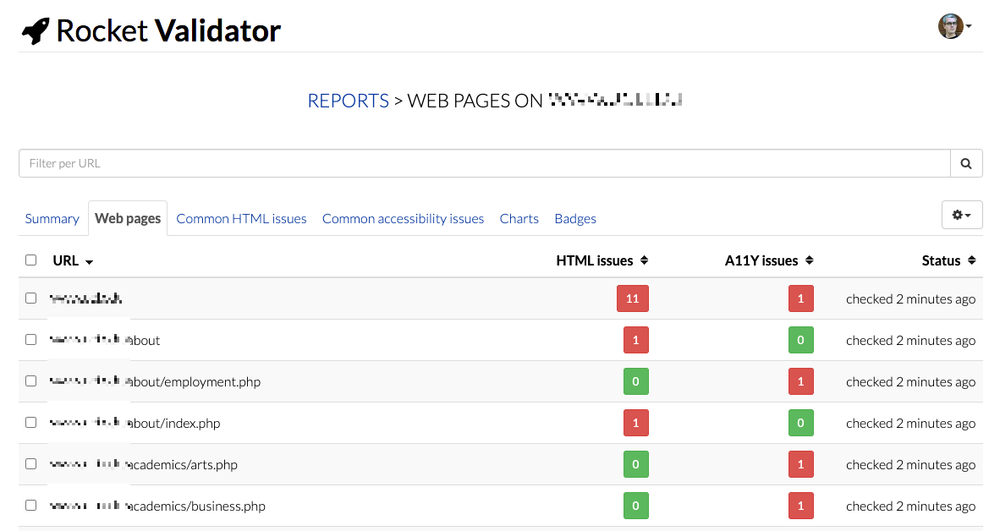

=== "Bulk recheck"
    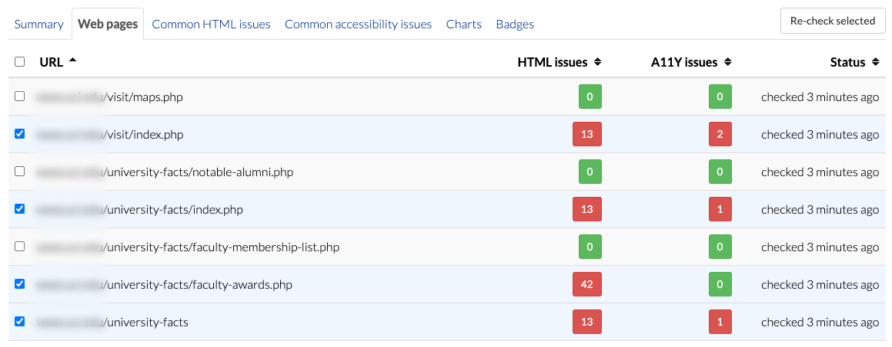

=== "Previous"
    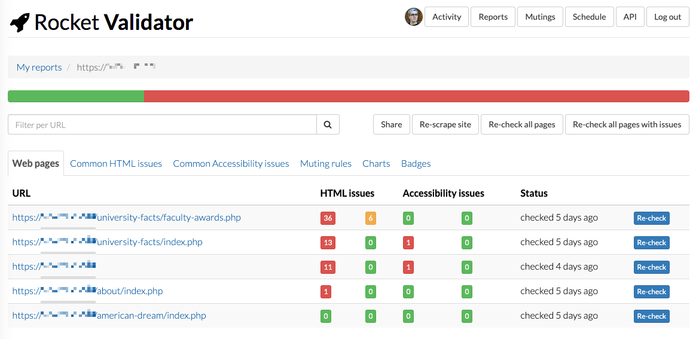

## 2020, April 22nd

### HTML checking is now optional.

Previously, the HTML check was always included, but now you can **decide what checks to include** on the reports: HTML and/or accessibility.

This lets you save credits on your account and work with a more focused checking scope when you need it.