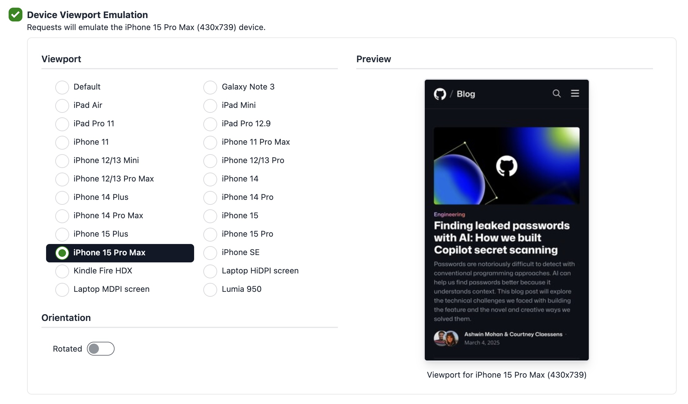

# Device Viewport Emulation

Your sites may have different issues at various screen resolutions because they don't look the same on a laptop, an iPhone, a Kindle Fire, or a Galaxy Note. 

When running an accessibility report, you can choose from a list of popular devices to emulate their **screen resolution**, **device scale factor**, **User Agent string** and **orientation**.

## Emulating a device viewport

To emulate a device viewport, just enable the **Device Viewport Emulation** when creating a report, choose a device from the list, and optionally check the **rotated** option:

## Currently supported devices

- Galaxy Note 3 (360x640, DPR 3)
- Kindle Fire HDX (800x1280, DPR 2)
- Laptop with HiDPI screen (1440x900, DPR 2)
- Laptop with MDPI screen (1280x800, DPR 1)
- Lumia 950 (360x640, DPR 4)
- iPad Air (820x1180, DPR 2)
- iPad Mini (768x1024, DPR 2)
- iPad Pro 11 (834x1194, DPR 2)
- iPad Pro 12.9 (1024x1366, DPR 2)
- iPhone 11 (414x828, DPR 2)
- iPhone 11 Pro Max (414x896, DPR 3)
- iPhone 12/13 Mini (375x812, DPR 3)
- iPhone 12/13 Pro (390x844, DPR 3)
- iPhone 12/13 Pro Max (428x926, DPR 3)
- iPhone SE (320x568, DPR 2)

Check the [full list of supported devices](https://rocketvalidator.com/devices) in Rocket Validator. 