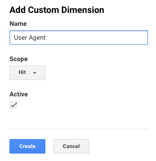
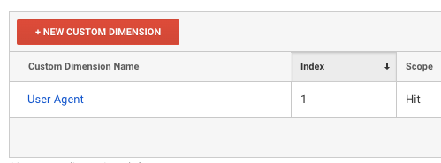
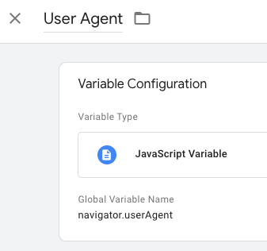
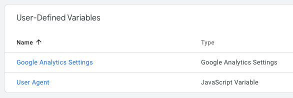
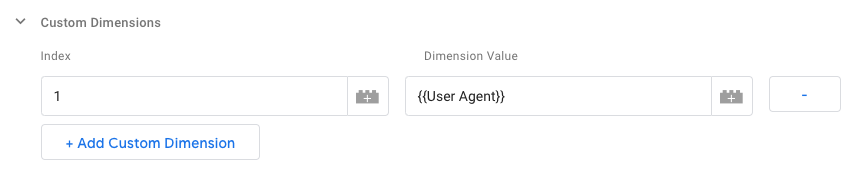
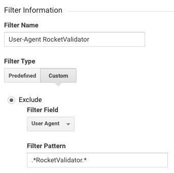

# Excluding Rocket Validator Bots from Google Analytics Traffic

As explained in the <a href="/user-agents">User Agents</a> section, when you validate a site with Rocket Validator, your server will be visited by 3 different systems: Link Spider, HTML Checker and Accessibility Checker.

The first two will just get the static HTML content, but the Accessibility Checker behaves like a real browser (using Headless Chrome), so it's going to execute JavaScript in the visited pages - and that includes the Google Analytics script, if it's there.

So, it's perfectly normal to see a spike in the Google Analytics traffic when you're validating a site. But in most cases, you can prefer to exclude this traffic from the stats.

There are 2 options to do that, let's explore them.

## Not rendering the Google Analytics script

This is the simplest option - you can change the Google Analytics script in your site so that it will not be executed if the User Agent contains `RocketValidator`. This can be detected using JavaScript.

Here's an example, this goes right after the opening `<head>` tag.

```html
<script>
// Set your Google Analytics ID here
const GA_ID = 'YOUR-GA-ID-HERE';

if (!navigator.userAgent.includes('RocketValidator')) {
  (function() {
    var script = document.createElement('script');
    script.async = true;
    script.src = 'https://www.googletagmanager.com/gtag/js?id=' + GA_ID;
    document.head.appendChild(script);

    window.dataLayer = window.dataLayer || [];
    function gtag(){dataLayer.push(arguments);}
    gtag('js', new Date());
    gtag('config', GA_ID);
  })();
}
</script>
```

## Filtering out from Google Universal Analytics

The second option requires a bit more work to set up but it's cleaner. There's nothing to set up on your server and the content stays the same. What you need to to instead is tell Google Analytics to filter out requests depending on the User Agent string.

### Setting up Google Analytics via Google Tag Manager

First step is having Google Analytics installed via the Google Tag Manager. This way, it's easy to extend it with custom dimensions, like the User Agent.

Follow this guide: <a href="https://support.google.com/tagmanager/answer/6107124?hl=en">Deploy Google Analytics with Tag Manager</a>.

### Create a custom dimension for User Agent

Next, go to your Google Analytics admin panel. Click on "Custom Definitions" in the "Property" column, and select "Custom Dimensions". Create a new Custom Dimension with the name "User Agent".



Write down the "Index" value for the created Custom Dimension as we'll need it later.



### Create a variable in Google Tag Manager

Now, go to your Google Tag Manager account and click on "Variables" on the left-hand side menu. Click on "New" under "User-Defined Variables". Set the name as "User Agent", the Variable Type as "JavaScript Variable" and the Global Variable Name as `navigator.userAgent`. Click on "Save". This will set up a JavaScript variable that will store the User Agent string, so it can be passed to Google Analytics.



### Define a custom dimension in Google Analytics Settings

Still on the Google Tag Manager Variables section, click on the Google Analytics Settings variable:



Edit the tag settings, open "Custom Dimensions" and click on "Add Custom Dimension". Set the index to the index matching the custom dimension in your Google Analytics account. Set the Dimension Value to `{{User Agent}}`.



This will pass the User Agent to Google Analytics. Remember to Publish your changes in Google Tag Manager so they're enabled.

### Create a filter in Google Analytics

The last step is going back to your Google Analytics account, Admin section. Click on "Filters" on the "View" column. Click on "Add Filter". Set the Filter Name as "User-Agent RocketValidator". Choose "Custom" in Filter Type. In the Exclude option, select the field "User-Agent" on the Custom Dimensions. And, in Filter Pattern, use this regular expression: `.*RocketValidator.*`.



And that's it! It may take some time for the filter to take effect (but in most cases it's just a matter of minutes). This method does not remove traffic retroactively - it can only filter out traffic happening after the creation of the filter.
