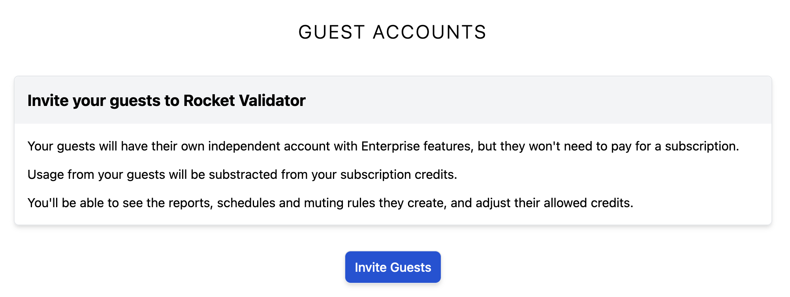
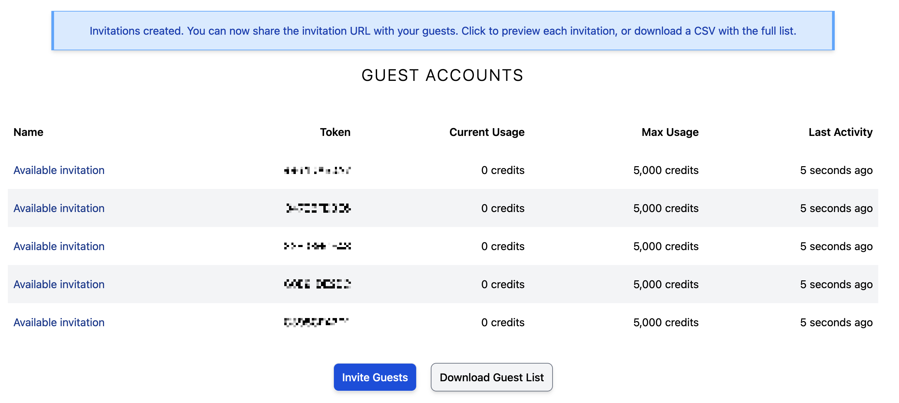
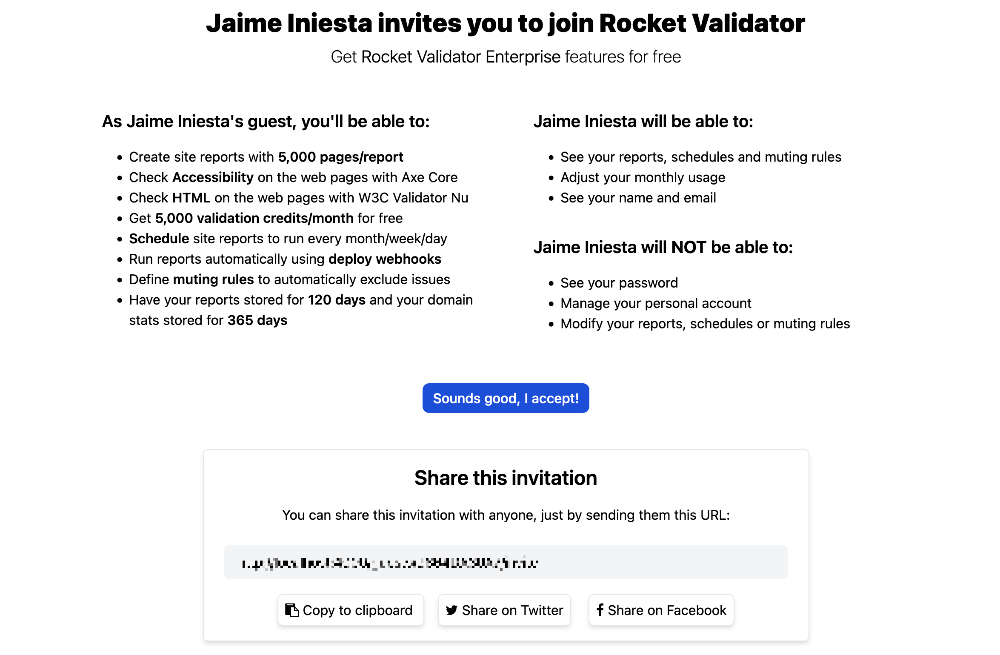
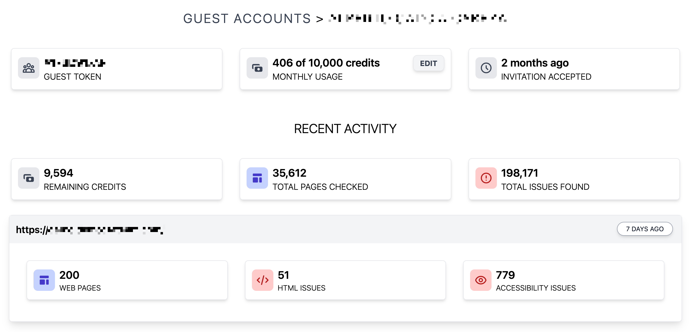
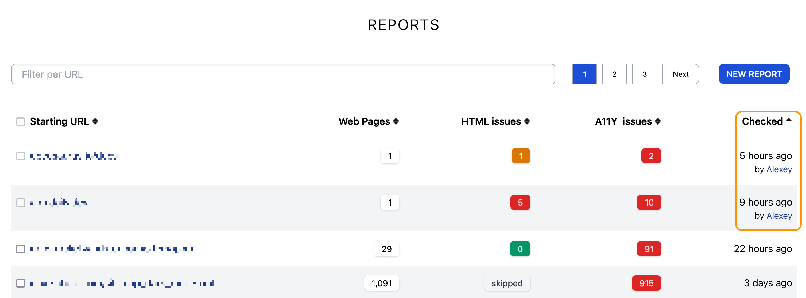

# Guest Accounts

A Guest Account is a way to invite other Rocket Validator users to share your subscription resources in terms of validation credits and features, without compromising your main account credentials.

Your guests will be able to sign up for free, no credit card required, but still run HTML and Accessibility validation reports, set up schedules, define muting rules and use the API, on their own accounts. Their usage will be substracted from your main account credits, up to the limit you define.

As a host, you can supervise your guests' activity. You can see the reports your guests generate, and have your domain stats up to date with the data from your guests' reports. You control how many credits they can use per month, and can cancel or adjust at any time.

The Guest Accounts feature is only available for users with a **Pro** or **Enterprise** subscription. With each Pro subscription, you get 5 guest accounts, which are designed for small and medium-sized organizations. For larger organizations, you can subscribe to the [Enterprise plan](https://rocketvalidator.com/contact?enterprise=true), which gives you 100 guest accounts per subscription. If you need more than that you can just subscribe to additional packages.

## Creating your Guest Accounts invitations

The first step for having your guest accounts set up is creating the invitation tokens. To do that, go to the [Guests](https://rocketvalidator.com/guests) section and click on the **Invite Guests** button:

Then, fill in the form to specify how many invitations to create, and how many allowed credits per month will be allowed for each invitation. In the next screenshot you can see how we create 5 invitations, with 5,000 allowed monthly credits each:

## Sharing your Guest Accounts invitations

Once you have created the invitations, you'll see the list of available invitations. Each invitation has a unique token - think of it like a coupon code, a voucher or a gift card, that you can share with anyone so that they can create an account for free.

Click on any of the invitations and you'll see a preview of the invitation, as your guests will see it. At the bottom you'll find the instructions to share the invitation (basically you just need to pass them the URL).

You can also download the invitation list as a CSV file by clicking on the **Download Guest List** button. This can be useful to keep track of who has been assigned to each invitation.

## Checking your guest activity

You'll be notified by email once your guests accept the invitation. At that point, they'll be able to run their own reports, and you can see their activity by clicking on their name in the Guests section:

On this screen you'll find:

- **Your guest's token**. This can be useful to get their reports via the API.
- **Current and maximum usage**. This shows how many validation credits the user has spent for the current month, and what the maximum allowed credits per month is. Usage is reset at day 1 of each month, but you can also modify it at any time from here.
- **Recent activity**, including:
  - **Remaining credits** in the guest user account.
  - **Total pages checked and issues found**. Click on them to get a list of all the reports by this user.
  - A list of the **recent reports**.
- A link to **remove** the guest account. Handle with care!

## Integrated reports and domain stats

Your guest reports are also integrated into your main [Reports](https://rocketvalidator.com/s) list. When a report has been created by a guest, you'll see the guest user's name in the Checked column.

Similarly, your [Domain Stats](domain-stats.md) automatically merge the data from your guest reports. Domain Stats always take the freshest results for web pages; if you have a report for a site but a guest has a more recent report for some of the pages in that domain, their version will take precedence. This ensures domain stats get the most up-to-date data.

## Guest Accounts via the Reports API

Check out the [Guest Reports API guide](api/reports.md#list-your-guest-reports) to learn how to get your guest accounts' reports using the API. This will let you retrieve the reports created by all your guests, or filter by a single guest using the guest token.

