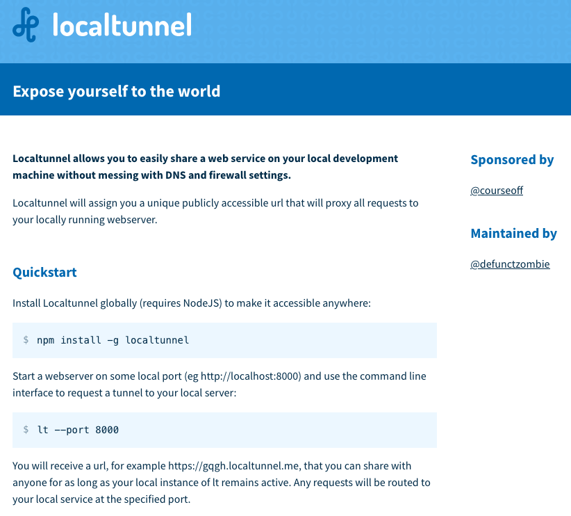

# Validating your local server

Rocket Validator can validate your local development server, which provides the fastest development experience as you can skip the deployment phase. All you need is to set up a local tunnel to your local server, so you have a public URL that Rocket Validator can access.

## Using your local server port

If you're already working with a local server, you just need to find out what the local port is. For example, in case of Rails applications, the default port is `3000`. For Phoenix applications, the default is `4000`. This may be customized, in the end it's the numeric part in the url after the `:`, for example in `http://localhost:3000` the port is `3000`.

## Launching a local server


If you're not working with a local server, for example when you just have a directory with static files, you can quickly launch a server using [serve](https://www.npmjs.com/package/serve). You can install it with one line:

```
npm install --global serve
```

Once installed, you can run this command inside your project's directory with:

```
serve
```

And this will run a server in the port `3000`. Run `serve --help` for a list of other options.

Once you have a running development server and you know your port number, you just need to set a up a tunnel to get a public URL.

## localtunnel

[localtunnel](https://localtunnel.github.io/www/) is a free and open source service that lets you expose your local development server with a public URL.



Install it with:

```
npm install -g localtunnel
```

And launch your local tunnel with the `lt` command, indicating the port where your server is running:

```
lt --port 3000 
```

This will create a random URL for you - we recommend using the `--subdomain` option to set a custom subdomain for your site, like this:

```
lt --port 3000 --subdomain example
```

That's all you need!

You can now use your public URL (in the above example, it would be `https://example.loca.lt`) to validate your development server with Rocket Validator.

## Other tunnel providers

We love localtunnel because it's open source, doesn't require sign up, and lets you use subdomains for free, but there are many other tunneling services that you can use:

* [ngrok](https://ngrok.com/)
* [boringproxy](https://boringproxy.io/)
* [Telebit](https://telebit.cloud/)
* [tunnel.pyjam.as](https://tunnel.pyjam.as/)
* [Expose](https://expose.dev)
* [TunnelTo.dev](https://tunnelto.dev)
* [PageKite](https://pagekite.net/)
* [Zrok](https://zrok.io/)
* [Remotemoe](https://github.com/fasmide/remotemoe)
* [Loophole](https://loophole.cloud/)
* [Localhost.run](https://localhost.run/)
* [KubeSail](https://kubesail.com/homepage)
* [LocaltoNet](https://localtonet.com/)
* [Cloudflare Tunnel](https://developers.cloudflare.com/pages/how-to/preview-with-cloudflare-tunnel/)
