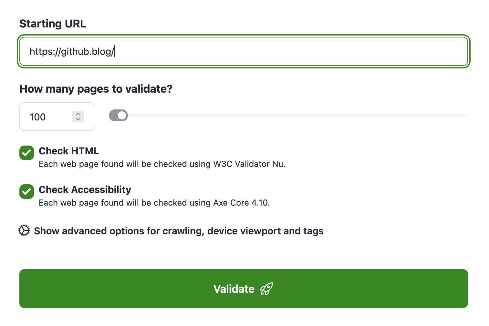

# Welcome to Rocket Validator!

<a href="https://rocketvalidator.com" target="_blank">Rocket Validator</a> is the tool used by professional web developers worldwide to quickly detect accessibility and HTML issues on large web sites, in an automated way.

Basically, Rocket Validator is an automated accessibility scanner: just submit a starting URL and our spider will discover the internal pages, and check each of them using the latest versions of the <a href="https://github.com/validator/validator" target="_blank">W3C HTML Validator</a> and the <a href="https://www.deque.com/axe/" target="_blank">axe-core accessibility engine</a>, producing a detailed report in seconds.

## Quick Start

To begin validating your sites you just need to <a href="https://rocketvalidator.com/registration/new" target="_blank">create an account</a>.

Once you have done that, you'll be prompted to validate your first site by entering a starting URL and clicking on "Start validation".

### Options

To validate a site, you can define:

* **Starting URL**. Our validation spider will visit this URL and its direct internal links, and validate those pages. Typically, you can enter the main URL of the site to validate, but it can be any URL from your site, or an XML sitemap.
* **How many pages to validate**. The maximum number of pages to validate. There's a limit on the pages included depending on your account level, but you'll typically want to set a much lower limit. If you need to validate more than that, consider using XML sitemaps to organize pages into sets.
* **Validation speed (requests/second)**. Can be set from 1 to 5 (Basic users) or 1 to 15 (Pro users).
* **Validate HTML and Accessibility or only HTML**. Pro users can choose to include A11Y checks on top of HTML checks.

### Re-checking your pages

Once your site has been processed, you'll see the HTML and accessibility issues for each page found. As you go fixing them, you can re-check the pages quickly:

* **Re-check** button on each page. This will submit an individual page to the validator.
* **Re-check all pages with issues** button. This will submit all pages with errors or warnings to the validator.
* **Re-check all pages** button. This will submit all pages on the site to the validator.
* **Re-scrape site** button. This will start the scraper again, to discover the internal pages of the site and validate each of them. Use only if the structure of your site has changed or if you want to change any parameter (like max pages).
