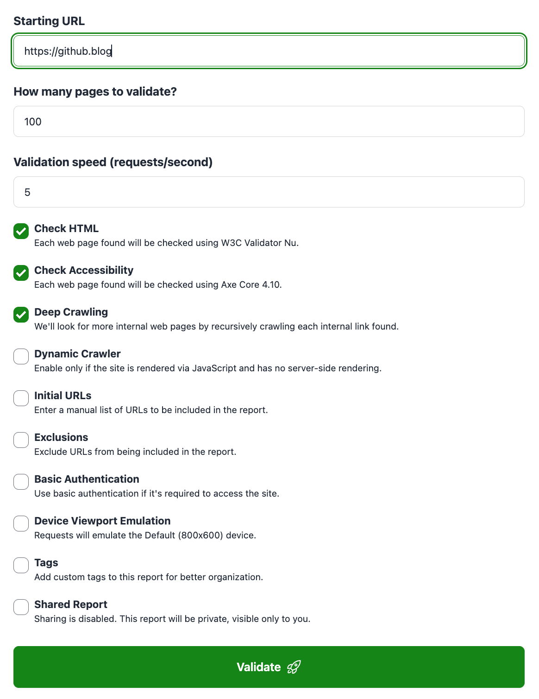

# Quick Start

To begin validating your sites you just need to <a href="https://rocketvalidator.com/registration/new" target="_blank">create an account</a>. There's a free trial that lets you validate HTML, and a <a href="https://rocketvalidator.com/registration/new?plan=pro-weekly&coupon=7DAYS" target="_blank">Pro trial</a> that gives you access to the advanced features like accessibility checking, muting rules, scheduled reports, and more.

Once you have created your account, you'll be prompted to validate your first site by entering a starting URL and clicking on the "Validate" button.

## Options

To validate a site, you can define the following options.

* **Starting URL**. Our validation spider will visit this URL and recursively follow the internal links, validating each internal web page found. Typically, you can enter the main URL of the site to validate, but it can be any URL from your site, or an XML sitemap.
* **How many pages to validate**. The maximum number of pages to validate. There's a limit on the pages included depending on your subscription plan, but you'll typically want to set a much lower limit. If you need to validate more pages than the limit on a report, consider using XML sitemaps to organize pages into sets.
* **Check HTML and/or Accessibility**. Pro users can choose to include A11Y checks on top of HTML checks.

## Advanced options

By clicking on the "Show advanced options" link, you'll have access to the advanced options that add additional features to your report.

* **Validation speed (requests/second)**. Can be set from 1 to 3 (Micro users), 1 to 5 (Basic users) or 1 to 15 (Pro and Agency users).
* **Deep Crawling**. When enabled, our crawler will recursively look for more internal web pages following the links found.
* **Dynamic Crawler**. Use the dynamic crawler to validate pages that are loaded via JavaScript. Requires a Pro, Agency or Enterprise subscription.
* **Initial URLs**. When enabled, it allows you to define a list of URLs to be included as the starting web pages of the report.
* **Exclusions**. When enabled, it lets you to define a list of paths to be excluded from the web pages list by our web crawler.
* **Basic Authentication**. Set the [basic authentication credentials](/basic-authentication) to use when validating pages that require authentication. Requires an Agency or Enterprise subscription.
* **Device Viewport Emulation**. Optionally choose a device to emulate while validating the page for accessibility issues. This will set the viewport's width, height and device scale factor to the ones in the selected device. If none selected, the default 800x600 viewport will be used. Requires a Pro, Agency or Enterprise subscription.
* **Tags**. A comma-separated list of tags to apply to the generated report.
* **Shared Report**. By default, the report is private and only accessible to you. If you want to share it with others, you can enable this option to get a shareable link.

## Re-checking your pages

Once your site has been processed, you'll see the HTML and accessibility issues for each page found. As you go fixing them, you can re-check the pages quickly with:

* **Re-check this page** button on each page. This will submit an individual page to the validator.
* **Re-check all pages** button. This will submit all pages on the site to the validator.
* **Re-check all pages affected by an issue** menu. This will submit all pages with errors or warnings to the validator.
* **Re-scrape site** button. This will start the scraper again, to discover the internal pages of the site and validate each of them. Use only if the structure of your site has changed or if you want to change any parameter (like max pages).
