# Site Validation Reports

A site validation report shows the results of running the selected engines (W3C Validator and/or Axe Core) on the web pages our scraper found on your site.

There are three main sections in a site report:

* **Summary** shows the main counters and scores, a selection of the highest-impact issues on the site, and a list of the most affected pages.
* **Web Pages** lists all the web pages our scraper found on your site, so you can check the specific issues on each one.
* **Issues** groups those individual issues into common issues, so you can see each distinct problem across the whole site.

Let's look at each one.

## Summary

The Summary shows the site's main counters and scores, along with the issues and pages that need the most attention based on their impact.

### Scores and counters

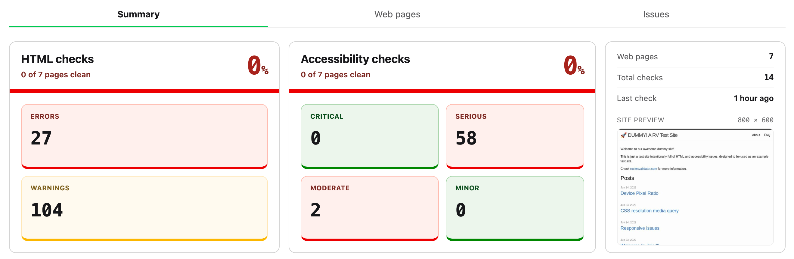

The first section of the Summary shows, for each kind of check (HTML by W3C Validator and/or accessibility by Axe Core), the score and the number of issues.

The score is the percentage of web pages that are completely free of issues. For example, if 30 out of 100 pages are clean, the score is 30%. There are two scores, one for HTML and one for accessibility.

The counters shown below display the number of errors and warnings (for the HTML checks) and the number of issues by severity (critical, serious, moderate, minor) for the accessibility checks.

Lastly, the third card shows the number of web pages included in the report, the total number of checks, the date of last check, and a screenshot preview of the site at the selected device viewport resolution.

### Where to start

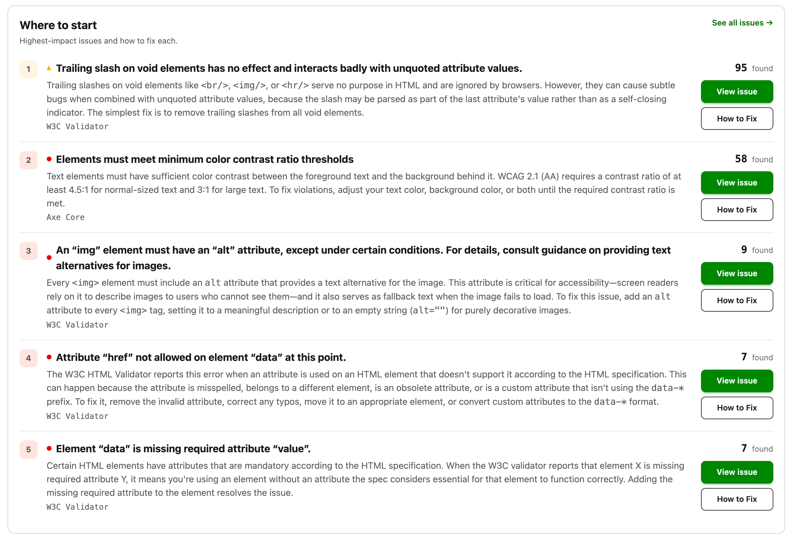

This section lists the top issues on the site, the ones with the highest impact. For each one, we show its description, a short introduction from the help guide, and links to the issue itself and to its help guide.

### Needs manual review

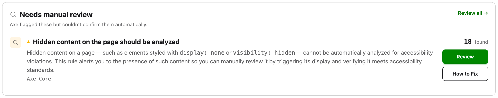

If you enabled the option to store manual reviews when setting up the report, this section highlights the top issues that need one, much like the section above.

### Most affected pages

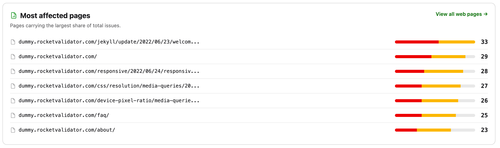

This section lists the pages that carry the most issues compared to the rest of the site.

## Web Pages

The Web Pages section lists every page included in your site validation report, showing how many issues each engine found on it. Use the checkboxes to select several pages and re-check or delete them in bulk.

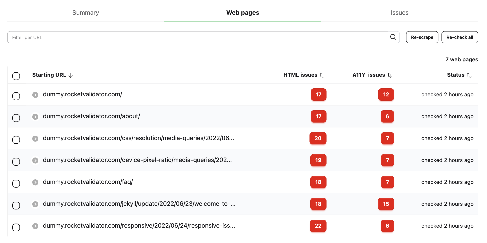

Click a web page to see all its details and issues.

### URL, device preview and actions

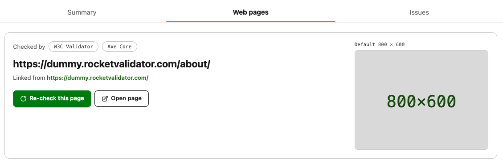

The top section of the Web Page shows its URL, where it was linked from (that's how the scraper discovered it), a preview of the device viewport resolution, and two action buttons:

* **Re-check this page** lets you run the checks again for the current page.
* **Open page** opens the page at the device resolution in a separate window.

### Engine counters

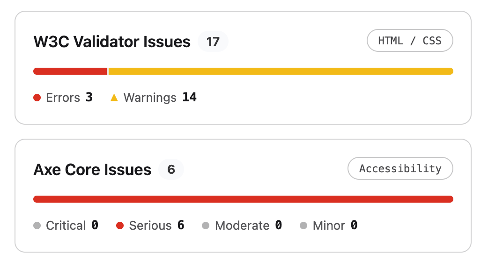

For each engine used (W3C Validator and/or Axe Core), you'll see the total number of issues, along with a breakdown by severity.

### Issues on this page

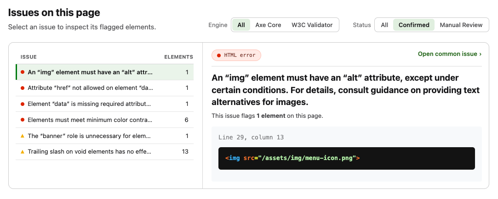

This shows every issue found on this page, grouped by issue. You can apply several filters to narrow down what you're looking for.

#### Filtering by engine and confirmation status

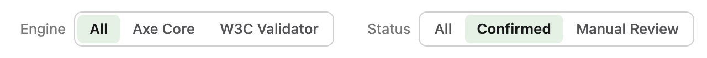

These filters let you narrow down the issue list by:

* **Engine**. Show all issues, or only those reported by W3C Validator or Axe Core.
* **Status**. Show all issues, only confirmed ones, or only those that need a manual review. W3C Validator only produces confirmed issues, while Axe Core produces both violations and "incomplete" checks that need a manual review.

### Filtering by issue

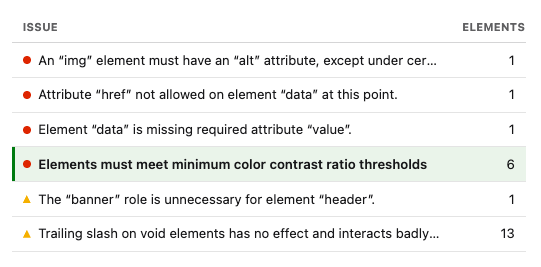

This lists the different issues on the page, along with how many elements each one affects. Click an issue to see its details in the pane on the right.

### Issue elements

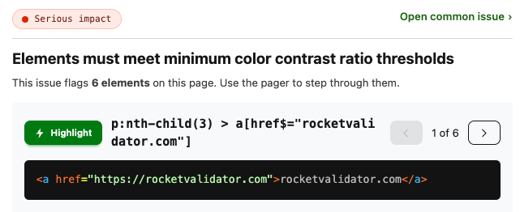

This shows the issue details and the elements it affects on the current page. Use the navigation buttons to move between them. Each element shows an HTML snippet and, where available, a CSS selector and a Highlight button that displays it directly on your live web page (this requires the Rocket Validator Highlighter Chrome extension).

Finally, the **Open common issue** link takes you to the common issue page, where you'll find its context and the other web pages affected by the same problem.

## Issues

Where the Web Pages section looks at your site one page at a time, the Issues section looks at it one problem at a time. It groups every individual issue found across the site into **common issues**, with one row per distinct problem. A single common issue (for example, a color contrast problem) can affect many elements across many pages, so this view lets you work through problems by impact instead of page by page.

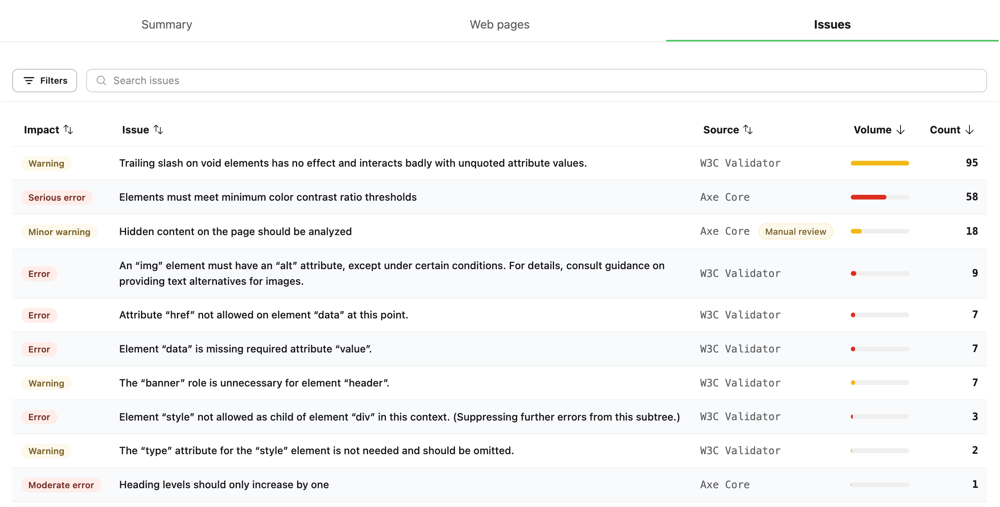

Each row is a common issue, described by these columns:

* **Impact** is the severity of the issue, from errors and warnings (W3C Validator) to critical, serious, moderate and minor (Axe Core).
* **Issue** is the description of the problem.
* **Source** is the engine that reported it, W3C Validator or Axe Core. Axe Core issues that need a manual review are flagged with a **Manual review** badge.
* **Volume** is a bar that shows, at a glance, how widespread each issue is compared to the rest.
* **Count** is the total number of individual issues of this type found across the site.

Click any column header to sort by it, and use the **Search issues** box to filter the rows by text. The counter at the bottom tells you how many issue types and how many individual issues are currently in view.

Click a row to open its common issue page, described below.

### Filtering issues

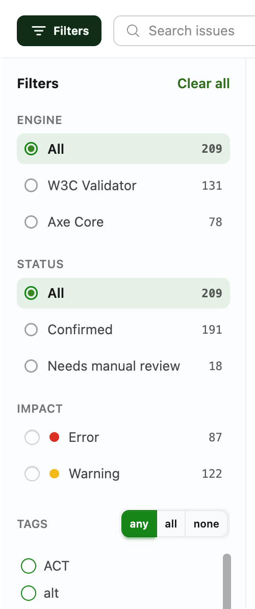

The **Filters** button opens a sidebar that narrows down the list. Every option shows the number of matching issues next to it, the button displays a badge with the number of active filters, and **Clear all** resets them at once.

* **Engine**. Show all issues, or only those reported by W3C Validator or Axe Core.
* **Status**. Show all issues, only **Confirmed** ones, or only those that **Need manual review**. W3C Validator only produces confirmed issues, while Axe Core produces both confirmed violations and "incomplete" checks that need a manual review.
* **Impact**. Filter by severity. The levels offered depend on the selected engine: errors and warnings for W3C Validator, and critical, serious, moderate and minor for Axe Core.
* **Tags**. Every issue is tagged with the standards and categories it relates to (WCAG, ACT, ARIA, alt, color…). Pick one or more tags and choose whether an issue must match **any**, **all** or **none** of them.

### Issue detail

Clicking an issue opens its **common issue** page, which gathers everything about that single problem across the whole site. As an example, we'll look at the Axe Core issue *"Elements must meet minimum color contrast ratio thresholds"*.

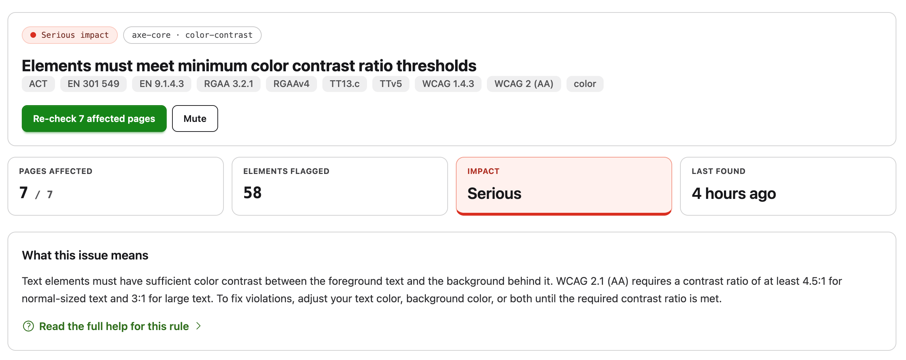

The top of the page shows the issue **impact**, the engine and rule that reported it (`axe-core · color-contrast`), its full description, and the **tags** for the standards it relates to (WCAG 2 AA, WCAG 1.4.3, EN 301 549, RGAA, ACT…). Two buttons let you **Re-check the affected pages** or **Mute** the issue so it no longer shows up in this report.

Below the header, a set of cards summarizes the issue: the number of **pages affected** out of the total, the number of **elements flagged**, the **impact** level, and when it was **last found**. The **What this issue means** card adds a short, plain-language explanation, with a link to **Read the full help for this rule** in our guides.

#### Affected elements

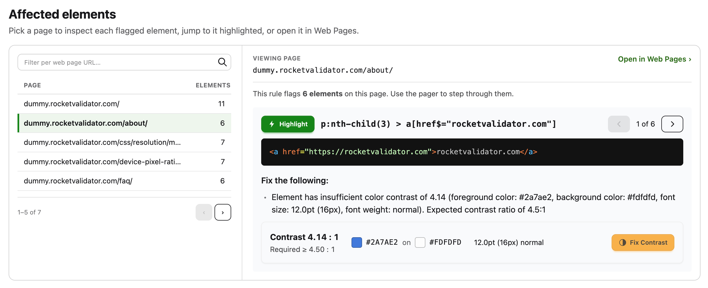

The **Affected elements** section lets you inspect every element flagged by this issue, page by page.

On the left, a list shows each affected web page along with how many elements are flagged on it. You can filter this list by URL and page through it, then select a page to load its flagged elements on the right. From there, **Open in Web Pages** opens this same issue on the selected page, over in the Web Pages section, so you can see it in the full context of that page.

The viewer on the right steps through each flagged element with the pager, showing:

* The **CSS selector** and a **Highlight** button that displays the element directly on your live web page (requires the Rocket Validator Highlighter Chrome extension).
* The **HTML snippet** of the offending element.
* A **Fix the following** description with the exact problem reported by the engine.

For color contrast issues there's an extra panel that shows the measured **contrast ratio** next to the required one, the foreground and background colors, and the text size. Its **Fix Contrast** button opens the [Rocket Validator Contrast Checker](https://tools.rocketvalidator.com/contrast-checker) with those colors pre-filled, so you can work out an accessible combination.