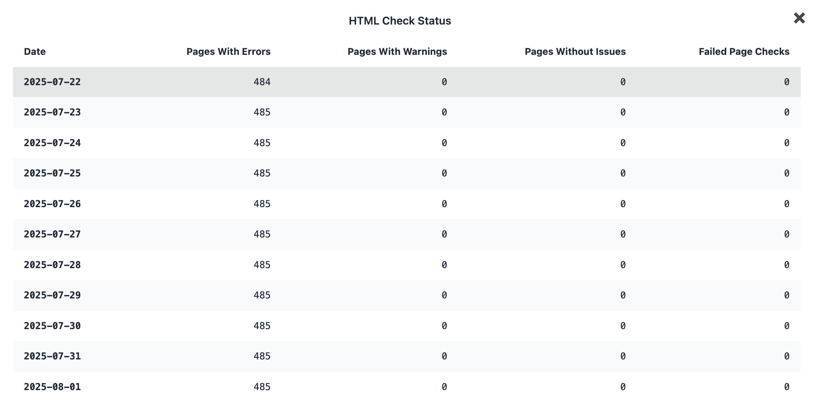
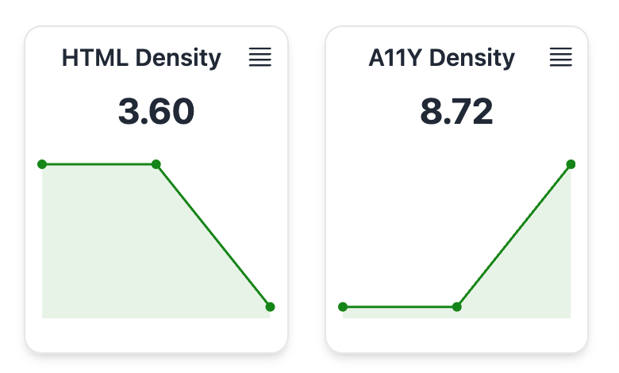

# Stats

The Stats section, available for Micro, Basic, Pro, Agency and Enterprise users, shows stats for the evolution of the checked domains, based on daily snapshots automatically generated from the data in your reports.

## Filtering stats per domain or tag

The Stats section shows the statistics from all your reports for the latest 30 days by default, which gives a high level overview, but you can narrow the stats to show only the domains you're interested in using the search bar on top. You can also filter per tag or tag combination.

## Filtering by date range

By default, we'll show the last 30 days of stats. You can pick a different date range using the drop down on the top right: last 7, 30, 90 or 365 days (depending on what your subscription plan allows), or pick a custom date range.

## Showing the stats in table format

Each graph shown in the Stats section can also be shown in table format, which provides an accessible alternative and can also be easily copied into a spreadsheet for further analysis. Just click in the top left icon to open the table data.

## Stats included

Stats data is shown in different chart types, in this section we'll explore each one of them.

### Reports and Web Pages

The Reports chart shows the number of site validation reports stored, as a line chart for the selected range. On top of that, the current number of reports (from the last date in the date period) is shown.

The Web Pages chart is similar, but shows the number of distinct URLs stored in the reports, as a line chart for the selected date range and also highlighting the current (last date) value.

### Issue Density

The concept of issue density represents the average number of issues per check. For example if you have a site validation report that checks 100 web pages, and you find 500 HTML issues, then your HTML issue density is 5 issues per page. This is a valuable metric to check how your site quality is evolving over time.

These two charts show the HTML and A11Y issue density over the date range as a line chart, and the current (last in period) value highlighted on top.

### Current Status

These pie charts show the check status, both for HTML and for A11Y checks, for the last date in the selected period (by default, the current date).

These charts show the proportion of web pages that have errors (red), warnings (yellow), no issues (green), or failed checks (black).

The pie charts correspond to the last bar in the Check Status Evolution bar chart, explained below.

### Check Status Evolution

These bar charts show the evolution over time of the check status, both for HTML and for A11Y checks.

Each bar represents a date, and shows the proportion of web pages that have errors (red), warnings (yellow), no issues (green), or failed checks (black).

### Total Issues Evolution

These bar charts show the evolution over time of the number of total issues, both for HTML and for A11Y checks.

Each bar represents a date, and shows the proportion of errors (red) and warnings (yellow).

## Latest Reports

Below the charts, the latest site validation reports that match the selected stats filters will be shown.  

## Sharing Stat Views

Stat Views let you share your validation stats through a public URL. Anyone with the link can see the same stats and related reports based on the filters you set.

### Creating a Stat View

First, in the Stats section, apply the filters you want to share, such as:

- **Team Scope** – just you, your whole team, or specific users  
- **Tags** – one or more tags, using modes like *any*, *all*, or *none*  
- **Domain search**  
- **Date range**

Your charts update automatically as you change filters. When ready, click the **Share** button next to the filters:

### Adding Details

Clicking **Share** opens a modal where you can enter a name and an optional description:  

Give it a clear name and, if needed, describe the filter criteria and the reports included (for example, how often they run or which device viewports are set).

### Sharing and Editing

After saving, you’ll be redirected to the new Stat View. As the owner, you’ll see:

- A **Share** button to copy the public URL  
- An **Edit** button to update the name or description  

### Recent Reports

Each Stat View also shows the list of recent reports below the charts. This makes it easy to review the latest HTML and accessibility issues directly from the stats page.

