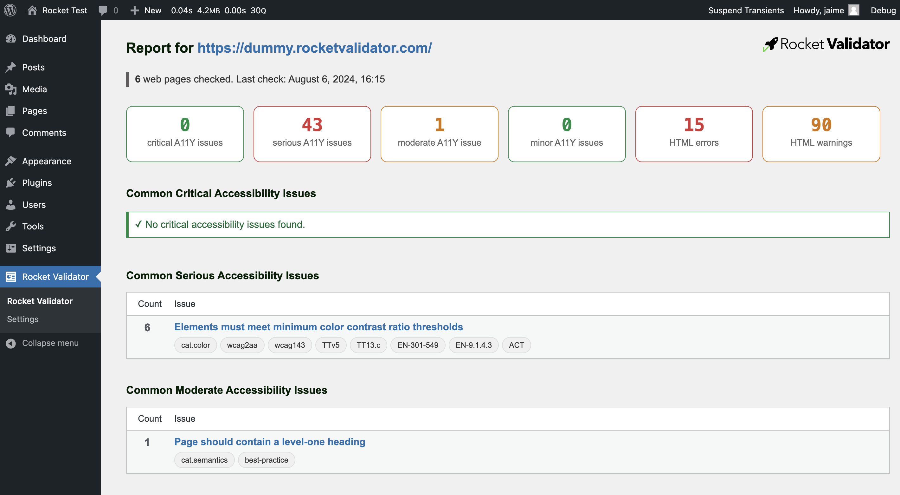
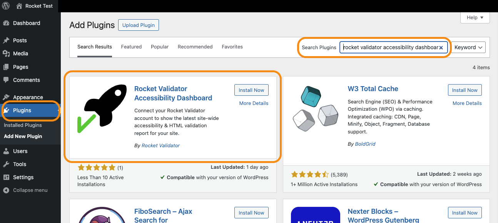
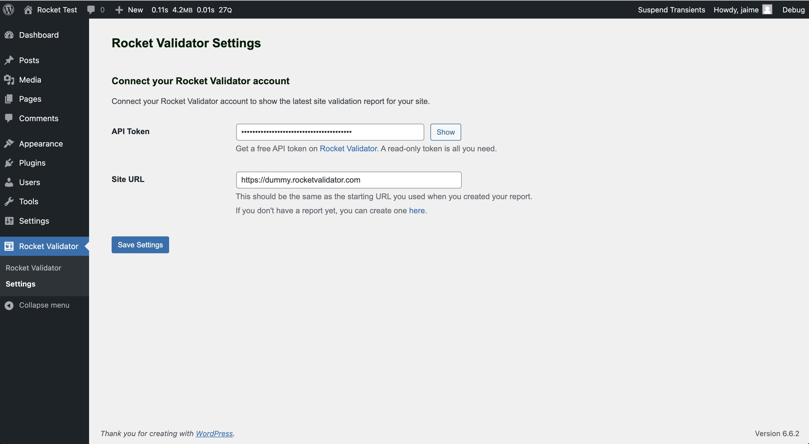

# WordPress plugin

Our official WordPress plugin displays the most recent site-wide accessibility and HTML validation report for your website, retrieved from your connected Rocket Validator account and displayed within your WordPress admin interface.

## Installation

The plugin is available on the [WordPress repository](https://wordpress.org/plugins/rocket-validator-accessibility-dashboard/). You can install right from the WordPress dashboard of your site.
Just go to the Plugins section, search for "Rocket Validator Accessibility Dashboard" and click on **Install Now** and then **Activate**.

## Setup

After installing the plugin, you can access the Rocket Validator menu in the side menu of the WordPress dashboard. You'll need to enter a read-only API token to connect to your Rocket Validator account, and define your site's URL, which will be used to retrieve the most recent site-wide accessibility and HTML validation report.

You can create an API token [from the Rocket Validator website](https://rocketvalidator.com/api/tokens). Remember to select the **Read-only access** option, as the plugin doesn't need write access.

## Usage

Once you've entered your API token and site URL, you'll be able to see the most recent site-wide accessibility and HTML validation report right from your WordPress dashboard.

The report shows counts for the number of HTML and A11Y issues found, and a list of those issues, with direct links to get more information for each issue.

## Uninstallation

If you ever need to uninstall the plugin, just go to the Plugins section, search for "Rocket Validator Accessibility Dashboard" click on **Deactivate** and then **Delete**.

Also remember to [delete the API token](https://rocketvalidator.com/api/tokens) from your Rocket Validator account if you're not using it anywhere else.